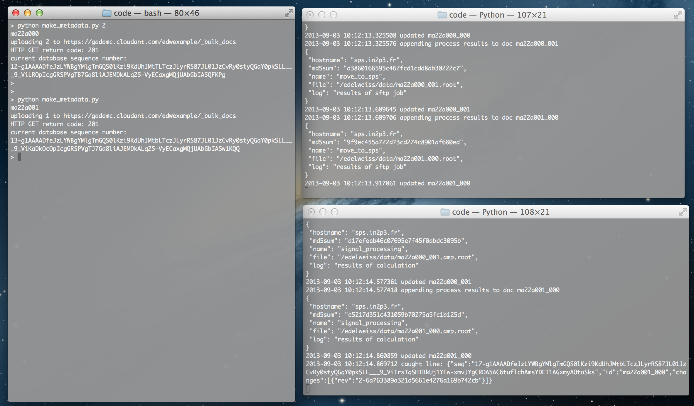

#Example Process Management tool using Cloudant

The python scripts in this repository exemplify the process management system described in the three part Cloudant Blog post about the EDELWEISS experiment (parts [1](https://cloudant.com/blog/searching-for-dark-matter-with-cloudant-part-1/), [2](https://cloudant.com/blog/searching-for-dark-matter-with-cloudant-part2/), and [3](https://cloudant.com/blog/searching-for-dark-matter-with-cloudant-part3/)). In EDELWEISS we have built a system based on the Cloudant database service that monitors and drives the processing steps of our physics data. This is done by creating a JSON document on Cloudant for each physics data file produced by our experiment (roughy 5 data files per hour). The documents hold the metadata for each data file, including experimental run condtions and the results of each step in the processing chain. 

In this example, two steps of the data processing chain in EDELWEISS are simulated. The first step moves the physics data files from the experiment site to our data processing center. The second step simulates the results of performing a first step in the physics analysis (digital signal processing). 

This system works by a combination of a filtered _changes feed and a MapReduce view that act as a notification system for when new JSON documents are added to the database or updated. New or updated documents trigger the execution of callback functions that perform the appropriate operation on the physics data files. The results of the callback are then added back to the JSON document on Cloudant, which then triggers the subsequent processing step.

The steps to run this example code are

* Install the requirements
* Configure/Setup 
    * credentials 
    * _design document
* Run
    * script to add new documents to the database
    * two scripts that simulate the data processing and update of the metadata documents. 

## Requirements

    pip install requests
    pip install couchapp # optional

## Configuration

[Sign up for a Cloudant account](https://cloudant.com/sign-up/) (or install a local CouchDB) and create an example database, e.g. 'edwexample'. 

Clone this repository.

    git clone https://github.com/gadamc/edwexample

Edit the edw.ini file (but don't change the viewname).

Upload the design document. This can be done in two ways. The python script, upload_design.py, reads the design.process.json file and PUTs it to your database using the credentials in edw.ini.

    python upload_design.py

Or, you may use the couchapp tool. The couchapp tool (or [erica](https://github.com/benoitc/erica)) is the recommended method for installing production couchapps and _design documents and its use is quite simple. The couchapp tool reads a folder structure, produces the _design document in JSON and uploads it to the database.

    cd couchapp
    couchapp push https://<username>:<password>@<username>.cloudant.com/<dbname>

## Running the example code

You'll need three terminal windows open to watch the scripts in action. The following will show you how to run the example and explain what is happening. 

#### New documents

First, open a terminal and upload some example documents to the database. 

    python make_metadata.py 2  # uploads 2 documents

Each document looks something like this:

    {
        "_id": "ma22a000_000",
        "_rev": "1-da479417036aba083b69f551cdeff656",
        "status": "good",
        "md5sum": "977f5c2288038a593d04eb35b08670b2",
        "run": "ma22a000",
        "datecreated": 1378222673.477208,
        "process": [
        ],
        "conditions": {
            "volts": {
                "detector_a": [
                    8,
                    -8,
                    2,
                    -2
                ],
                "detector_b": [
                    4,
                    -4,
                    1.5,
                    -1.5
                ]
            },
            "temperature": 0.015842423014516688
            },
    "original_file": "/mnt/data/ma22a000_000.root"
    }

You can see a few of the example run conditions, such as the temperature - with a ridiculously high implied precision, and voltages applied to the germanium crystals. The "original_file" holds the path to the physics data file on the data acquisition machine.  The "process" key is where the process management stores results from different steps in the processing chain. Its also where the MapReduce function (_design/process/_view/lastproc) looks to emit information about the last processing step performed on the physics document. 

#### Listener scripts

In a second and third terminal, turn on the 'listener' scripts.

    python listen_newfiles.py
    python listen_analysis1.py

The 'listener' scripts wait for any output from the _changes feed that occurs after the script was started (see the listener.py code for how it gets the latest sequence number from the database and waits for all events after that sequence number.)  Both of these listener scripts observe the _changes feed through a filter function (defined in the _design document) and then run a callback function for new or updated documents on the database that are emitted by the MapReduce function. 

The MapReduce function emits key:value pairs that look like ['name', doc['_id']] : 1. The 'name' is value of doc['process'][N-1]['name'], where N is the length of doc['process']. If doc['process'] is an empty list, the MapReduce function emits the key:value pair [0, doc['_id']] : 1. One then queries the MapReduce function with appropriate startkey and endkey values to select documents that represent physics data files at particular points in the data processing chain. 

The listen_newfiles.py script handles new physics data files. It gets documents from the MapReduce view with key = [0, doc.['_id']]. Its job is to move the data files from the computers in the underground lab to our batch processing system. This is simulated here by adding the first item to the doc['process'] list 'name':'move_to_sps'.

The listen_analysis1.py script handles data files that have been moved to the batch processing system. It gets documents emitted by the MapReduce view with key = ["move_to_sps", doc['_id']]. Its job is to perform some signal processing on the raw physics data file and to store the results of those data in a new physics data file (you'll see the 'newfile' in the listen_analysis1.py code)

To see this in action, add a new document to the database

    python make_metadata.py

Here's a screenshot similar to what you should now see.

As you can probably imagine, its not so difficult to add subsequent processing steps in a similar way. 

