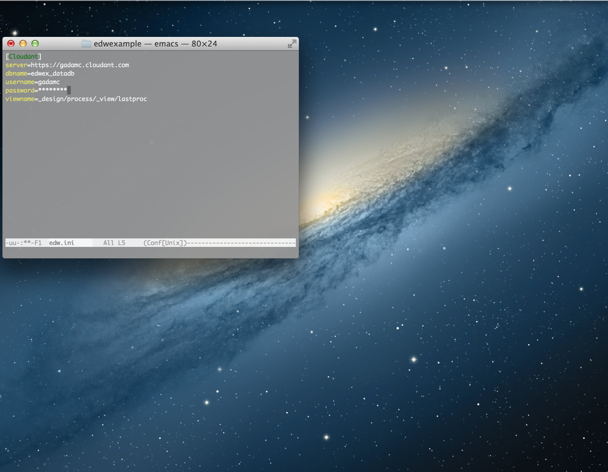
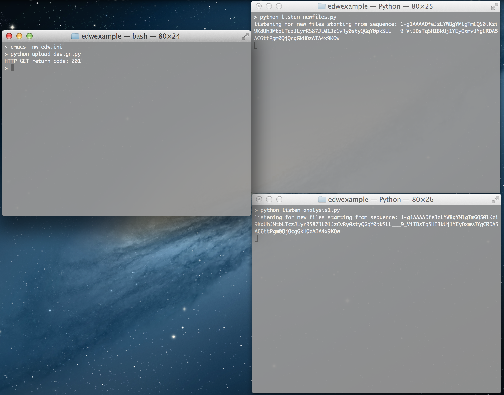
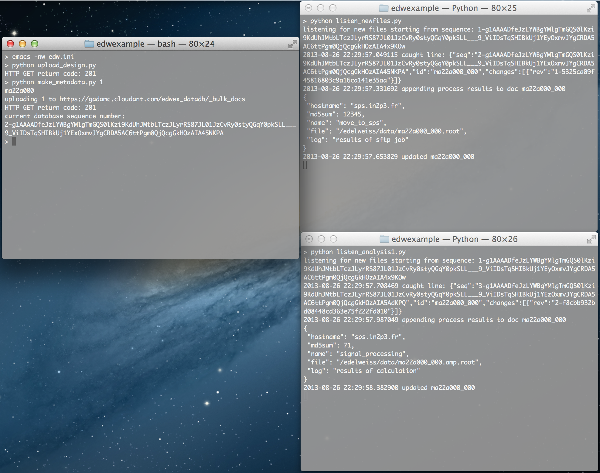

#Example Process Management tool using Cloudant.

This example code uploads documents to a database and comes with two "listener" scripts that watch a filtered output from the _changes feed and reacts accordingly. Other than the Mapreduce views in the _design document, this example is entirely in Python.

You'll first need a Cloudant account (or local CouchDB) and a database to hold your data. In this example, I called my database 'edwex_datadb'.  Once you have this set up then

1. pip install requests
2. edit edw.ini

3. python upload_design.py
4. open two terminals and run the "listener" scripts
	* python listen_newfiles.py
	* python listen_analysis1.py

5. python make_metadata.py 1  

In this last step, the number in argument to the script is the number of new docs to create and add to the database. You can change this number, of course.

